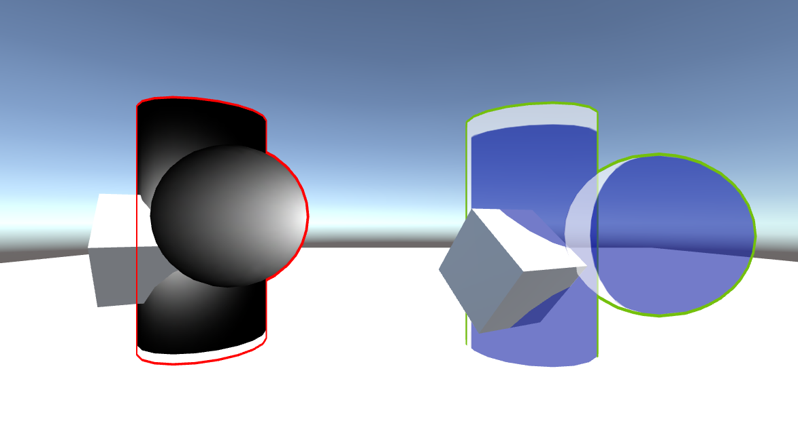

# About
The material is used to render one model's outline. screenshot of the effect:
###

## Shader Parments
Outline Color : Outline's color  
Outline Factor : The lerp factor of vertice's local position and vertice's normal. 
Outline Width : Outline's width. 
Body Alpha : The body's alpha value, used to controll body's alpha.

# 说明
该材质能绘制模型边框，同时保持模型的透明度，不是基于后处理深度图的描边

## Shader参数
Outline Color : 描边的颜色 
Outline Factor : 顶点本地坐标的单位向量和顶点法线单位向量的插值因子 
Outline Width : 描边边的宽度 
Body Alpha : 模型自身的透明度
